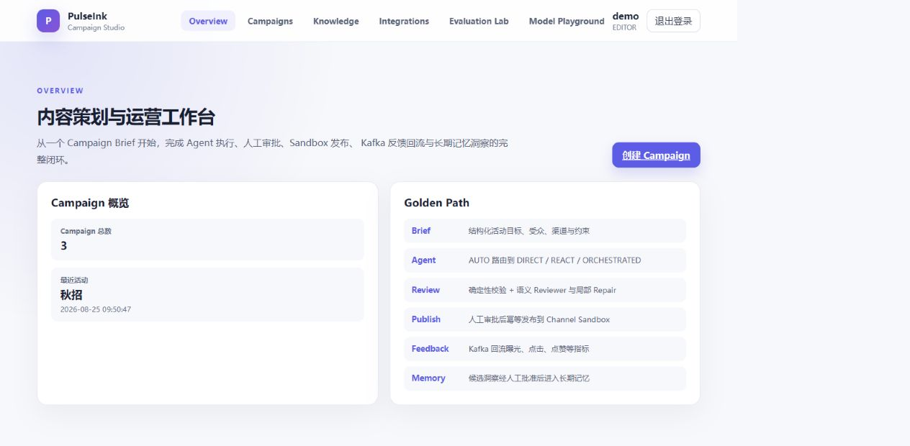
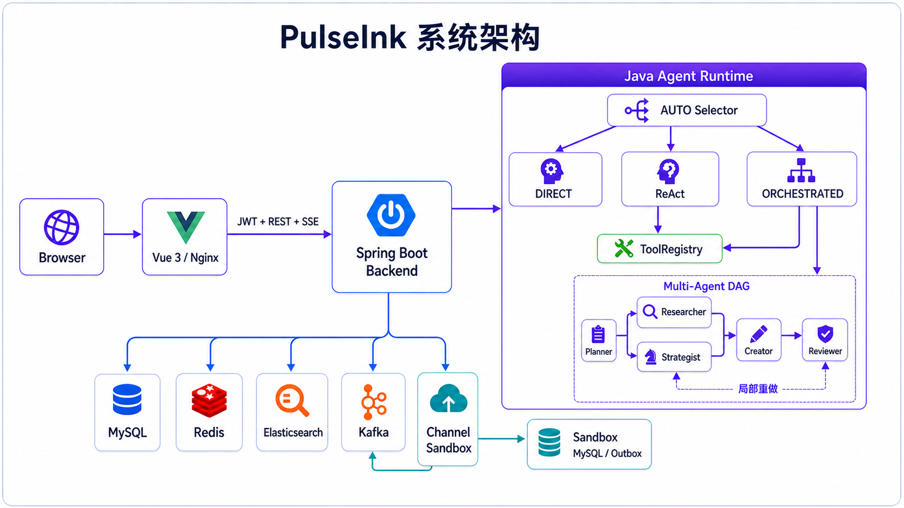

<div align="center">

# PulseInk

**面向内容活动的 Java Agent 智能工作台**


</div>

PulseInk 是一个使用 Java 构建的内容活动智能工作台。用户提交活动目标、目标受众、发布渠道和内容要求后，
系统可以检索品牌知识、选择 Agent 执行方式、生成并审核内容，在人工批准后发布到本地 Channel Sandbox，
再根据反馈沉淀可复用经验。

它不是一个只包装模型对话接口的聊天应用，而是一个包含 Agent Runtime、知识检索、人工治理、异步反馈
和可解释评测的完整开源项目。

> PulseInk 面向本地学习、技术交流和架构参考。项目提供的是产品级 MVP，不应未经安全加固直接用于生产。



## 产品流程

```text
Campaign Brief
   ↓
执行模式选择（DIRECT / REACT / ORCHESTRATED）
   ↓
知识检索、任务规划与多角色协作
   ↓
内容生成 → Reviewer 审核 → 人工编辑与 Approval
   ↓
Channel Sandbox 发布 → Kafka 反馈 → Metrics
   ↓
人工批准的长期经验
```

Web 界面会展示模式选择、Plan DAG、实际参与角色、工具调用、Evidence、内容版本、审核意见、发布记录、
反馈指标和评测结果。

## 核心能力

- **Java Agent Runtime**：Spring AI 负责底层模型通信，自研 Java 运行时负责结构化决策、工具回填、
  状态推进、超时、预算和失败分类。
- **三种执行方式**：简单任务使用 DIRECT；需要工具或校验时使用 ReAct；复杂任务使用多角色协作。
  AUTO 根据渠道数量、任务依赖和事实风险选择实际引擎。
- **五角色协作**：Planner、Researcher、Strategist、Creator、Reviewer 共用执行内核，通过 Role Profile
  分别限制任务说明、上下文范围、工具权限、输出类型和执行预算。
- **受控 Tool Calling**：模型只能提出调用请求，Java ToolRegistry 负责工具注册、白名单、参数校验、
  风险等级、权限和超时控制。
- **知识与引用**：上传文件经 Apache Tika 解析和切片后写入 Elasticsearch，通过 BM25、KNN 与 Java
  RRF 混合召回；内容 Artifact 保留可追踪的 `sourceRefs`。
- **人工治理**：Reviewer 失败时只重做受影响任务；内容支持人工修改、版本管理和 Approval，未经批准
  的版本不能发布。
- **可靠发布与反馈**：发布使用业务幂等键，Channel Sandbox 使用 Transactional Outbox，Kafka 采用
  at-least-once 消费并通过事件记录避免重复业务效果。
- **受控长期记忆**：模型归纳的跨活动经验先进入候选状态，只有人工批准后才写入检索索引。
- **Evaluation Lab**：内置 18 个固定 Case 与 6 个 Smoke Case，也支持用户输入任务和参考结果创建
  Custom Case；确定性规则先执行，语义 Judge 只对合法候选评分。

## 系统架构



Backend 采用模块化单体结构。Agent 内部使用同步调用和有界并行，Kafka 只用于 Backend 与独立 Sandbox
之间的异步反馈边界，不用于替代普通模块调用。

## 执行模式

| 模式 | 适用任务 | 主要行为 |
|---|---|---|
| DIRECT | 无需外部信息的简单生成 | 单次结构化模型调用，不执行工具 |
| REACT | 需要检索、验证或工具的任务 | 结构化决策协议驱动工具调用与结果回填，包含有界格式修复 |
| ORCHESTRATED | 可拆分、存在角色依赖的复杂任务 | Planner 生成 DAG，无依赖任务并行，Reviewer 触发局部修复 |
| AUTO | 用户不希望手动判断模式 | 根据任务特征选择上述一种实际执行引擎 |

多角色并不被假设为始终优于单 Agent。PulseInk 同时保留三种引擎，并通过真实轨迹、质量、Token、耗时和
协调开销进行比较。

## 技术栈

| 层次 | 技术 |
|---|---|
| Backend | Java 21、Spring Boot 4.1、Spring AI 2.0、MyBatis-Plus |
| Agent | 自研 DIRECT / ReAct / DAG 编排、Role Profile、ToolRegistry、Artifact |
| Data | MySQL 8.4、Redis 8、Elasticsearch 9、Kafka 4 |
| Frontend | Vue 3、TypeScript、Vite、Pinia、Element Plus、ECharts |
| Delivery | Docker Compose、Nginx、独立 Channel Sandbox |

## 快速开始

### 环境要求

- Docker Desktop 与 Docker Compose
- 建议为 Docker 分配至少 4 GB 内存
- 首次构建需要下载基础镜像和 Maven、pnpm 依赖

### 启动

```powershell
Copy-Item .env.example .env
docker compose up -d --build
docker compose ps
```

默认使用不需要 API Key 的 `fake` Provider。所有声明健康检查的容器变为 `healthy` 后，打开：

<http://localhost:5173>

本地演示账号：

```text
用户名：demo
密码：pulseink-demo
```

停止服务但保留命名 Volume：

```powershell
docker compose down
```

`docker compose down -v` 会删除本地数据库、索引、消息和知识文件，请只在确定不需要数据时执行。

## 使用真实模型

PulseInk 当前内置火山方舟和智谱两个 OpenAI-compatible Provider。复制 `.env.example` 后可选择其中一个：

```dotenv
PULSEINK_MODEL_PROVIDER=ark
ARK_API_KEY=your_key
ARK_BASE_URL=https://ark.cn-beijing.volces.com/api/v3
ARK_MODEL=your_model_or_endpoint_id
```

或者：

```dotenv
PULSEINK_MODEL_PROVIDER=zhipu
ZHIPU_API_KEY=your_key
ZHIPU_MODEL=glm-5.2
```

Embedding Provider 与 Chat Model 独立配置。其他 OpenAI-compatible 模型可复用或实现
`backend/src/main/java/com/pulseink/agent/model/AgentModelPort.java`，在
`backend/src/main/java/com/pulseink/client/model/` 下增加适配器，并在 `ModelConfiguration` 中注册 Provider。

## 仓库结构

```text
pulseink/
├─ backend/       # Spring Boot 模块化单体与 Java Agent Runtime
├─ frontend/      # Vue 产品界面与 Nginx 配置
├─ sandbox/       # 独立渠道模拟器与 Transactional Outbox
├─ evals/         # 固定 Case、Fixture、Schema、Rubric；本地报告被忽略
├─ compose.yml    # 应用与 MySQL、Redis、ES、Kafka 的本地拓扑
└─ .env.example   # 环境变量模板
```

## 本地开发与测试

Backend：

```powershell
./backend/mvnw.cmd -f backend/pom.xml test
```

Frontend：

```powershell
corepack enable
pnpm --dir frontend install
pnpm --dir frontend test
pnpm --dir frontend build
```

Channel Sandbox：

```powershell
./sandbox/mvnw.cmd -f sandbox/pom.xml test
```

## License

PulseInk 使用 [Apache License 2.0](LICENSE) 开源。

---

如果 PulseInk 对你有帮助，欢迎点个 **Star**。它不会提高模型质量，但会显著提高维护者的更新意愿。
